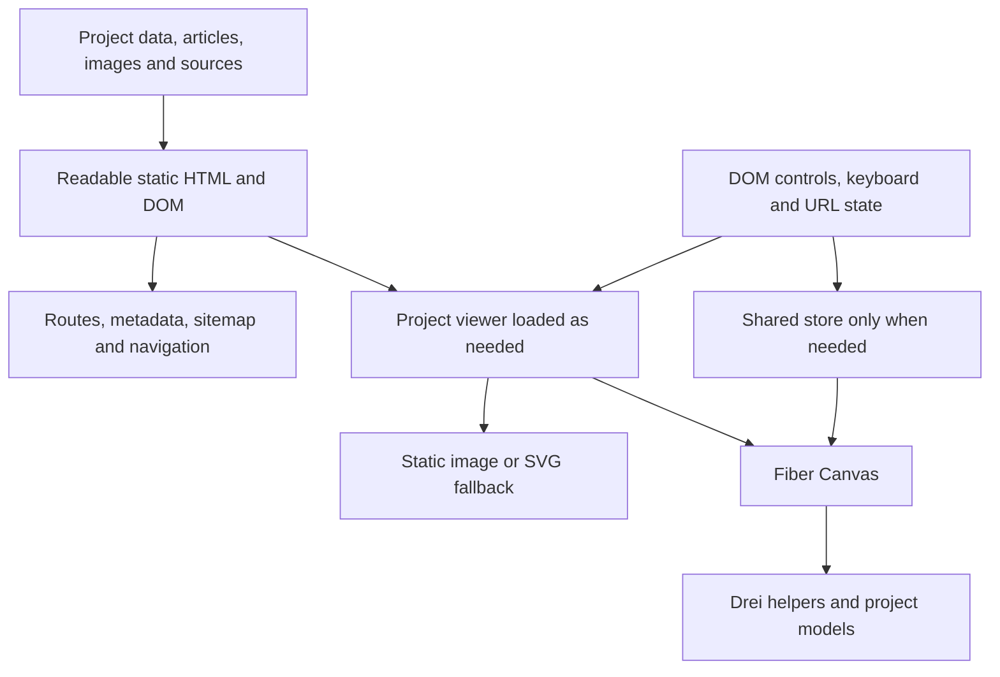

# Complete pmndrs Repository Review: Personal Website Development Guide

> See the [Design Technologies Engineer website direction](personal-website-direction.md) for the latest website decisions. This guide provides an organization inventory and technical-selection background; the direction document governs the actual content and experience.

Research date: **2026-10-04 (Europe/Berlin)**. Scope: **102 public repositories** under [Poimandres / pmndrs](https://github.com/pmndrs), including 10 archived repositories and 7 forks. Private repositories were outside the visible scope. This is a selection and development reference; the research did not install packages or modify website functionality.

Navigate: [Quick selection](#1-quick-selection) · [Website types](#3-choose-tools-by-website-type) · [Versions and names](#5-versions-and-names-pitfalls-checked-in-this-review) · [Performance and accessibility](#6-performance-accessibility-and-asset-strategy) · [Complete inventory](#8-complete-inventory-of-102-repositories).

## 1. Quick Selection

For a content-oriented personal website, pmndrs primarily adds interaction and graphics capabilities. It covers state, animation, gestures, 3D, physics, and development tools. Content structure, routing, SEO, accessibility, and deployment still need their own design.

For a website featuring design, research, architecture, or fabrication work, start by investigating these combinations:

| Requirement | Repository/package to investigate first | Reason |
| --- | --- | --- |
| Present 3D methods or models in React | [react-three-fiber](https://github.com/pmndrs/react-three-fiber) → `@react-three/fiber` | Organize Three.js scenes as React components; use 3D where it helps explain a project. |
| Model loading, camera control, environment lighting | [drei](https://github.com/pmndrs/drei) → `@react-three/drei` | Select the helpers needed to reduce loader/control infrastructure. |
| Convert GLB/glTF into editable components | [gltfjsx](https://github.com/pmndrs/gltfjsx) → development CLI | Generate model components; use `--transform` to produce web asset copies and inspect the results. |
| DOM or 3D spring animation | [react-spring](https://github.com/pmndrs/react-spring) → `@react-spring/web` / `@react-spring/three` | Describe motion through targets and springs; choose the package for the renderer. |
| Dragging, pinching, zooming, swiping | [use-gesture](https://github.com/pmndrs/use-gesture) → `@use-gesture/react` | Useful for interactive comparisons and manipulating work; provide keyboard control and natural scrolling. |
| Shared presentation state between DOM and Canvas | [zustand](https://github.com/pmndrs/zustand), or [jotai](https://github.com/pmndrs/jotai) / [valtio](https://github.com/pmndrs/valtio) | Choose one when cross-component state is needed; use React state and the URL for simple pages. |

**Suggested development order: readable content → static images/SVG → one purposeful interaction → model and loading optimization → physics, postprocessing, or XR only when needed.** This is the review's judgment for personal websites, not an official pmndrs maturity ranking.

## 2. Scope and Interpretation

The review inventoried descriptions, default branches, `archived`, `fork`, `pushed_at`, and GitHub license identification for all 102 repositories. It retrieved 96 root READMEs and inspected available root package.json files. It also checked subpackages in major monorepos, official documentation, and `latest` metadata for 19 npm packages.

The six repositories without root READMEs were checked through the Contents API: `.github` has `profile/README.md`; `lamina-wg` and `leva-wg` are empty; `market-assets` contains asset and API code; `market-assets-do` contains categorized asset directories; and `vhacd` currently contains only LICENSE and .gitignore. The root README of `p2-es` is a path pointer, so its subpackage README was also read. Sources: [organization inventory, page 1](https://api.github.com/orgs/pmndrs/repos?per_page=100&type=public&sort=full_name&page=1), [page 2](https://api.github.com/orgs/pmndrs/repos?per_page=100&type=public&sort=full_name&page=2).

This document distinguishes three kinds of evidence:

- **Upstream facts:** repository READMEs, package manifests, GitHub metadata, and npm metadata.
- **Adoption recommendations:** judgments based on personal-website use, integration cost, and the architecture inspected during this review.
- **Not verified:** builds/tests were not run for every repository, complete source and issue histories were not audited, and physical-device benchmarks were not performed. Declared compatibility does not mean integration has passed.

The A/B/C/D levels below indicate **use-case priority**, not quality or maintenance status:

| Level | Meaning |
| --- | --- |
| A | Worth investigating first for common personal-website requirements; install only for an actual feature need. |
| B | Valuable for specific situations, such as physics, generative graphics, XR, or advanced cameras. |
| C | Examples, development tools, editors, or learning material; usually excluded from the public runtime. |
| D | Organizational material, placeholders, superseded projects, or tools unsuitable for an ordinary personal website. |

"Last push" is the UTC date of `pushed_at`, **not the latest release, default-branch commit, or a maintenance guarantee**. Archived/fork status follows GitHub flags; an old date does not automatically mean deprecated. License entries are GitHub SPDX snapshots. "Unidentified" includes null and NOASSERTION and requires checking the repository, subpackage, or asset source. A code license does not establish the rights for every model or font.

## 3. Choose Tools by Website Type

### 3.1 Writing, CV, or Blog

React state, semantic HTML, CSS transitions, and static content cover most needs. Add `@react-spring/web` for complex spring animation and `@use-gesture/react` for draggable project comparisons. `website` offers an MDX article architecture to study; `docs` may suit technical documentation. Neither automatically converts an existing personal website. [Spring README](https://github.com/pmndrs/react-spring), [Website README](https://github.com/pmndrs/website), [Docs README](https://github.com/pmndrs/docs).

### 3.2 Design, Architecture, Computation, and Fabrication Portfolios

Start with an independent project viewer in Fiber, adding Drei's `useGLTF`, `OrbitControls` / `CameraControls`, `Environment`, or `Html` as needed. GLTFJSX can turn shareable models into components with editable materials or animation. For multiple 3D areas on a page, investigate Drei `View` and its shared Canvas rather than starting with the archived `react-three-scissor`. [Drei documentation](https://drei.docs.pmnd.rs/), [GLTFJSX README](https://github.com/pmndrs/gltfjsx), [Scissor replacement guidance](https://github.com/pmndrs/react-three-scissor).

Use 3D to explain scale, structure, process steps, or geometric differences. Keep project titles, responsibilities, outcomes, captions, and navigation in the DOM. Preserve understandable images and text during loading, WebGL failure, and operation on low-performance devices.

### 3.3 Explorable Exhibitions or Game-Like Work

Choose physics tools only for collisions, gravity, or walkable characters. On a React19/Fiber9 baseline, evaluate `@react-three/rapier` v2 first. `ecctrl` provides broader character/vehicle control; `BVHEcctrl` serves narrower character-collision needs. Consider Koota's ECS for many dynamic entities. Investigate `timeline` for camera narratives and experimental `klipp` for advanced virtual cameras. [Rapier documentation and versions](https://github.com/pmndrs/react-three-rapier), [Ecctrl](https://github.com/pmndrs/ecctrl), [Koota](https://github.com/pmndrs/koota), [Timeline](https://github.com/pmndrs/timeline), [Klipp](https://github.com/pmndrs/klipp).

### 3.4 Work That Actually Needs VR/AR

Use `@react-three/xr` for XR sessions and input, and `uikit` for spatial interfaces. Evaluate `viverse` for characters and VIVERSE features. Retain an ordinary-browser introduction, video, and 3D viewer, and let visitors explicitly enter a supported XR session. [XR](https://github.com/pmndrs/xr), [UIKit](https://github.com/pmndrs/uikit), [Viverse](https://github.com/pmndrs/viverse).

## 4. Suggested Architecture

Each layer can be replaced independently. Drei `Html` or tunnel-rat can connect a scene to the DOM, but core articles must not depend on Canvas to appear. SEO and sharing information come from content and route documents. Google also explains that prerendering helps crawlers and users unable to execute JavaScript. [Google JavaScript SEO guidance](https://developers.google.com/search/docs/crawling-indexing/javascript/javascript-seo-basics).

### Choosing State Management

| Tool | Suitable problems | Personal-website judgment |
| --- | --- | --- |
| React state / URL | Local expansion, current view, shareable search and categories | Default starting point; do not rewrite sufficient logic just to use a library. |
| Zustand | Shared selection, modes, settings, and selector subscriptions | Evaluate first for shared DOM/Canvas state. |
| Jotai | Small independent states, derived calculations, composable panels | Evaluate atoms when interactive parameters depend on one another. |
| Valtio | Direct editing of object models with Proxy and snapshots | Evaluate for parameter editors or mixed vanilla/React interactions. |
| Koota | Many entities, traits, queries, and real-time systems | ECS modeling costs are justified mainly by games or complex simulations. |

This compares use cases, not performance rankings. Update per-frame positions/rotations through refs, `useFrame`, or the tool's own animation mechanism rather than rerendering the entire React tree every frame. [Zustand README](https://github.com/pmndrs/zustand), [Jotai README](https://github.com/pmndrs/jotai), [Valtio README](https://github.com/pmndrs/valtio), [Fiber performance pitfalls](https://r3f.docs.pmnd.rs/advanced/pitfalls).

## 5. Versions and Names: Pitfalls Checked in This Review

### 5.1 Stable npm Releases Differ from Main Branches

The following uses **npm `latest` metadata from 2026-10-04**. These are research snapshots, not instructions to install everything. Recheck peers, release notes, and the lockfile when adopting a package. In particular, Spring's default `next` branch contains an 11 beta and must not be called npm stable. Fiber10 and newer WebGPU examples also do not mean Fiber9 has adopted those changes. [Spring repository](https://github.com/pmndrs/react-spring), [Fiber introduction](https://r3f.docs.pmnd.rs/getting-started/introduction).

| Package | npm latest snapshot | Declared relationship to the React19/Fiber9 baseline | Direct source |
| --- | --- | --- | --- |
| `@react-three/fiber` | 9.8.1 | React / React DOM `>=19 <19.4`; Three `>=0.156` | [metadata](https://registry.npmjs.org/@react-three%2Ffiber/latest) |
| `@react-three/drei` | 10.7.9 | Fiber `^9.0.0`, React / DOM `^19`, Three `>=0.159` | [metadata](https://registry.npmjs.org/@react-three%2Fdrei/latest) |
| `@react-three/postprocessing` | 3.1.3 | Fiber `>=9.7.0`, React `^19`; additional postprocessing peer | [metadata](https://registry.npmjs.org/@react-three%2Fpostprocessing/latest) |
| `@react-three/rapier` | 2.2.0 | Fiber `^9.0.4`, React `^19`, Three `>=0.159` | [metadata](https://registry.npmjs.org/@react-three%2Frapier/latest) |
| `@react-spring/web` | 10.1.2 | React / DOM declarations include 16.8, 17, 18, and 19 | [metadata](https://registry.npmjs.org/@react-spring%2Fweb/latest) |
| `@react-spring/three` | 10.1.2 | React declaration includes 19; Fiber `>=6.0`; test animation and demand mode | [metadata](https://registry.npmjs.org/@react-spring%2Fthree/latest) |
| `@use-gesture/react` | 10.3.1 | React `>=16.8` | [metadata](https://registry.npmjs.org/@use-gesture%2Freact/latest) |
| `zustand` / `jotai` / `valtio` | 5.0.15 / 3.0.1 / 2.3.2 | Each declares React `>=18`; there is no need to choose all three | [Zustand](https://registry.npmjs.org/zustand/latest), [Jotai](https://registry.npmjs.org/jotai/latest), [Valtio](https://registry.npmjs.org/valtio/latest) |
| `@react-three/a11y` | 3.0.0 | React / DOM `>=18`, Fiber `>=8`; verify keyboard and assistive technology | [metadata](https://registry.npmjs.org/@react-three%2Fa11y/latest) |
| `gltfjsx` | 6.5.3 | Development CLI; verify generated JSX, loaders, and models in this site | [metadata](https://registry.npmjs.org/gltfjsx/latest) |

Monorepo roots are often `private` or use placeholder versions, such as Fiber's `react-three-fiber--root@0.0.0`. Do not treat them as published npm versions. Broad peers in a README or manifest are not comprehensive compatibility tests.

### 5.2 Repository Names Are Not Necessarily npm Names

| Repository | Package/entry point to check for new code | Important detail |
| --- | --- | --- |
| `detect-gpu` | `@pmndrs/detect-gpu` | README documents the scoped-name migration; npm snapshot is 6.0.25. Old `detect-gpu` 5.x remains available, and Drei still depends on the old name. |
| `math` | `math`, including `math/time`, `math/noise`, and other entries | Former `pmndrs/maath` redirects here; current package is 0.1.0. Old `maath` 0.10.8 remains on npm and in Drei dependencies. Do not assume API compatibility. |
| `drei-vanilla` | `@pmndrs/vanilla` | Provides only some Drei-inspired helpers. |
| `use-cannon` / `use-p2` | `@react-three/cannon` / `@react-three/p2` | Repository names reflect historical or monorepo names. |
| `xr` / `uikit` | `@react-three/xr` / `@react-three/uikit` | Separate vanilla and UI-kit packages also exist; choose the appropriate entry. |
| `klipp` | `@kvvasuu/klipp` | The repository is in pmndrs but the package scope differs; experimental. |
| `glyph` / `scheduler` / `sky` / `upscaler` | `@pmndrs/glyph` / `@pmndrs/scheduler` / `@pmndrs/sky` / `@pmndrs/upscaler` | Check renderer, version, and capability requirements individually. |

Sources: [Detect GPU README](https://github.com/pmndrs/detect-gpu), [Math README](https://github.com/pmndrs/math), [Drei manifest](https://github.com/pmndrs/drei/blob/master/package.json), [Vanilla README](https://github.com/pmndrs/drei-vanilla), [Klipp README](https://github.com/pmndrs/klipp).

### 5.3 Distinguish WebGL, WebGPURenderer, and Actual WebGPU

The React entry of `sky` currently requires Fiber10 alpha.4 or later. The `react-three-jolt` subpackage is Alpha and requires Fiber10. `react-three-examples` uses Fiber10/Drei11 alpha and WebGPU. Prototype these separately; they are not ready-made additions to React19/Fiber9. [Sky README](https://github.com/pmndrs/sky), [Jolt subpackage](https://github.com/pmndrs/react-three-jolt/tree/main/packages/react-three-jolt), [Examples README](https://github.com/pmndrs/react-three-examples).

Glyph's Three integration requires **WebGPURenderer** and can use its WebGL2 backend, but does not support classic WebGLRenderer. In contrast, the WGSL compute path in `upscaler` is **WebGPU-only, with no WebGL fallback**. Its README recommends Three r186+, while metadata still lists a minimum peer of r184. Use the documentation's more specific capability requirements when choosing it. [Glyph README](https://github.com/pmndrs/glyph), [Upscaler README](https://github.com/pmndrs/upscaler).

`postprocessing` / `react-postprocessing` use the existing WebGL postprocessing pipeline. Do not directly copy nodes from WebGPU/TSL examples into it. A renderer change also requires evaluating controls, materials, postprocessing, asynchronous initialization, and device fallbacks. [Postprocessing README](https://github.com/pmndrs/postprocessing).

### 5.4 Avoid Starting New Work with Superseded Tools

| Older repository | Known upstream status | Direction for new work |
| --- | --- | --- |
| `use-asset` | Deprecated and archived | Upstream points to `suspend-react`. |
| `react-three-scissor` | Archived; README names a replacement | Use Drei `View`. |
| `rafz` | Archived and moved into the Spring monorepo | Check the current Spring subpackage; usually use the existing loop. |
| `uikitml` | README points to an external replacement | Evaluate `drawcall-ai/uikitml`; it is outside this 102-repository inventory. |
| `lamina` | Archived; author states reliability and maintenance problems | Investigate Three materials/shaders; upstream mentions CSM, which needs separate review. |
| `react-three-editor` | Archived | Investigate Triplex first for visual editing. |
| `native` | README explicitly says pre-alpha / migration in progress | Unnecessary for an ordinary browser-based personal website. |

Status and replacement guidance come from each [repository](https://github.com/pmndrs?tab=repositories)'s README; the inventory below supplies direct links.

## 6. Performance, Accessibility, and Asset Strategy

### Performance

- Static scenes can use `frameloop="demand"`. Invalidate correctly when interaction or animation begins, then stop unnecessary continuous updates when it ends. [Fiber scaling performance](https://r3f.docs.pmnd.rs/advanced/scaling-performance).
- Set reasonable DPR, shadow, and postprocessing quality. Measure mobile download, decoding, shader compilation, interaction frame time, and power use. GPU-tier estimates are initial quality hints only. Detect GPU documents that its GFXBench source stopped updating in 2025-12 and has return states for missing benchmarks or failed data downloads. [Detect GPU guidance](https://github.com/pmndrs/detect-gpu).
- GLTFJSX transforms, smaller textures, geometry/material reuse, and instancing address different costs. Visually compare compressed copies; do not promise fixed percentage savings. [GLTFJSX](https://github.com/pmndrs/gltfjsx).
- Decide whether to pause or unmount offscreen scenes based on model size. Repeatedly unmounting large GLBs can add decoding and compilation cost. Establish ownership of cached/shared resources before disposal. [Fiber pitfalls](https://r3f.docs.pmnd.rs/advanced/pitfalls).
- Low idle FPS in a demand scene may simply mean no frames are being drawn. Measure actual interaction; Node-only `labs` does not replace browser GPU or page-experience measurements. [Labs README](https://github.com/pmndrs/labs).

### Accessibility and Text

Provide visible DOM controls, focus indicators, keyboard paths, reset actions, and static alternatives that explain the work. Respect reduced motion and allow nonessential automatic camera movement to stop. If a mesh is interactive, investigate `@react-three/a11y` focus and announcements, while still testing keyboards and screen readers. [A11y README](https://github.com/pmndrs/react-three-a11y).

Prefer DOM typography for Traditional Chinese project explanations. Glyph is pre-release; its README marks CJK support as Partial, with vertical text and paging for large font sets unfinished. A text engine does not automatically provide complete Chinese typesetting. [Glyph support scope](https://github.com/pmndrs/glyph).

### Assets and Development Tools

`assets` / `market` can supply prototype material, and `drei-assets` lists multiple sources. Retain authorship and license records for the actual downloaded files. Publish controlled copies of required assets instead of depending on changeable raw URLs. `assets` provides compressed/subset content and should be dynamically imported; subset fonts may not contain Chinese characters. [Assets README](https://github.com/pmndrs/assets), [Drei Assets README](https://github.com/pmndrs/drei-assets).

Use Leva for lighting, material, and parameter tuning; Triplex for visual editing; and debuggers/test images for development diagnostics. A control panel belongs in the public interface only when the work itself needs public parameter interaction. Adopting Fiber does not require adding every development tool to the runtime.

## 7. Recommendations for the Portfolio Architecture at the Start of Research

This section is based on the README, package.json, `MethodScene.tsx`, `App.tsx`, `DevMcp.tsx`, and prerender code inspected at the start of research. **During research, the working directory changed to contain only .git. This is analysis of the starting snapshot, not a revalidation of the current checkout.**

The starting architecture used React 19.3.0, Fiber 9.8.1, Three.js 0.186.1, Vite, and GitHub Pages. Fiber was the only direct production dependency from pmndrs; Drei and Zustand were not direct website dependencies. Fiber itself depends on Zustand, so distinguish transitive installation from intentional site adoption. Fiber's declarations accommodate this React/Three combination; Fiber10 alpha is not a prerequisite.

| Priority | Possible next step | Why it fits |
| --- | --- | --- |
| 1 | Retain static route HTML, image/SVG fallbacks, and DOM project content | The starting site already had content, sharing metadata, and a sitemap; reading should not depend on 3D. |
| 2 | Add a model viewer with rotation, zoom, and reset when a project needs it | Evaluate Drei controls/useGLTF and GLTFJSX at that point rather than installing the entire toolset first. |
| 3 | Connect geometric parameters and DOM explanations to the same data | The initial scene had little local state; choose a store only when sharing across pages or sections becomes necessary. |
| 4 | Evaluate springs or a timeline for animated method narratives | Show structural changes and steps while retaining reduced motion and stoppable interactions. |
| 5 | Measure actual mobile interaction before choosing quality and effects | The initial Canvas already used demand rendering, a DPR cap of 1.5, and offscreen unmounting; idle FPS is not a throughput score. |

The original activation logic was `choice ?? !reducedMotion`: ordinary users automatically enabled the scene when its section entered the viewport; reduced-motion users defaulted to SVG. Not everyone had to click Enable 3D. Universal click-to-enable would be a separate product choice if reducing initial GPU cost became a future priority.

The original `r3f-mcp` / `r3f-mcp-server` dependencies were third-party development tools from the [r3f-mcp organization](https://github.com/r3f-mcp/r3f-mcp), **outside the 102 pmndrs repositories**, and were not required services for the public website.

## 8. Complete Inventory of 102 Repositories

Each name links to its upstream page for checking the README/source. Descriptions and cautions summarize official material and this review's personal-website judgments. Dates and licenses use the same GitHub API snapshot.

### 8.1 State, Async Resources, and React Foundations (11)

| Repository | Function and personal-website use | Level | Status and considerations | Last push (UTC) | SPDX snapshot |
| --- | --- | --- | --- | --- | --- |
| [zustand](https://github.com/pmndrs/zustand) | Lightweight store/selector state management for shared DOM/Canvas selection, display modes, and parameters. Start with local state on simple pages. | A | Do not route frequent frame updates through React setState; keep shareable filters in the URL. | 2026-09-29 | MIT |
| [jotai](https://github.com/pmndrs/jotai) | Manages interface data through small atoms and derived calculations, from shared state to asynchronous operations. Useful for composing filters, themes, and interactive panels as needed. | B | Use built-in state when sharing is unnecessary; async atoms require Suspense handling. Main-branch manifest uses ESM, Node >=22.12, and React >=18; compare with the installed release. | 2026-09-29 | MIT |
| [valtio](https://github.com/pmndrs/valtio) | Shared state through Proxy objects and reactive snapshots; useful for model-parameter editors and mixed vanilla JS/React interactions. | B | Read snapshots and write to the source. Choose whichever of Valtio, Zustand, or Jotai fits the requirement. | 2026-10-01 | MIT |
| [koota](https://github.com/pmndrs/koota) | Entities, traits, and queries organize real-time scene state and connect it to the interface. Useful for many dynamic objects, game-like interactions, or AR scenes; ordinary content sites do not need this structure. | B | ECS adds modeling cost. Ordered relations are explicitly experimental; direct store access can bypass safety and event checks. The private root version is not a package release. | 2026-10-04 | ISC |
| [suspend-react](https://github.com/pmndrs/suspend-react) | Connects asynchronous resources to React Suspense with keyed caching. Useful for custom asset loading; an existing loader may make another wrapper unnecessary. | B | Use Suspense and an error boundary; define cache keys and release behavior explicitly. | 2023-10-24 | MIT |
| [use-asset](https://github.com/pmndrs/use-asset) | Early asynchronous asset-cache/Suspense tool, useful for historical study. For new sites, evaluate suspend-react as directed upstream. | D | **Archived**; the README explicitly marks it deprecated. | 2023-06-30 | Unidentified |
| [tunnel-rat](https://github.com/pmndrs/tunnel-rat) | Transfers React elements from one renderer to another outlet, allowing controls created inside Canvas to appear in the DOM. | B | Use a shared parent or props for simple scenes; avoid unnecessary UI flow complexity. | 2024-01-15 | MIT |
| [its-fine](https://github.com/pmndrs/its-fine) | Accesses React's internal component tree, context, and container information for low-level abstractions across renderers. A personal website usually uses it indirectly through its 3D framework. | C | Depends on React internals; latest peer is React ^19. R3F already uses FiberProvider internally; ordinary features should avoid direct coupling to this layer. | 2026-09-24 | MIT |
| [react-nil](https://github.com/pmndrs/react-nil) | Uses React lifecycle, state, and effects for logic without visual output. Usually unnecessary for a personal website; more relevant to server experiments or testing. | D | Neither a DOM nor a 3D renderer; manifest requires React ^19. | 2025-01-13 | MIT |
| [eslint-plugin-valtio](https://github.com/pmndrs/eslint-plugin-valtio) | Detects common proxy/snapshot mistakes, including stale callback values and writes to snapshots. Useful for catching reactivity errors during development when adopting Valtio. | C | README provides ESLint 9 flat config and legacy configuration. Some examples use old proxyWithComputed APIs; compare with the Valtio version in use. | 2025-03-25 | MIT |
| [swc-jotai](https://github.com/pmndrs/swc-jotai) | SWC plugins for Jotai debug labels and refresh, useful only when both Jotai and an SWC compilation pipeline are used. | C | The site's @vitejs/plugin-react does not require these plugins merely because Jotai is installed. | 2025-12-14 | MIT |

### 8.2 Animation, Gestures, Measurement, Math, and Update Scheduling (9)

| Repository | Function and personal-website use | Level | Status and considerations | Last push (UTC) | SPDX snapshot |
| --- | --- | --- | --- | --- | --- |
| [react-spring](https://github.com/pmndrs/react-spring) | Spring-driven continuous animation for DOM and 3D components; useful for project cards, navigation feedback, expansion/collapse, and scene-state transitions. | A | Choose only @react-spring/web or /three as needed. Subpackages on the default next branch are 11.0.0-beta.1, not the npm stable release. | 2026-10-04 | MIT |
| [use-gesture](https://github.com/pmndrs/use-gesture) | React and vanilla event information for dragging, zooming, pinching, and more. Useful for interactive comparisons and swipe browsing; can work with springs. | A | Install @use-gesture/react or /vanilla. Pair gestures with keyboard support and native-scroll design. | 2024-07-15 | MIT |
| [react-use-measure](https://github.com/pmndrs/react-use-measure) | Hook-based element dimensions and position tracking, including resize/scroll changes. Useful for responsive canvases, pointer interaction, and aligning DOM with 3D. | B | Initial measurements are zero; relies on ResizeObserver. Enable scroll for nested-scroll tracking; debounce frequent updates if needed. | 2025-01-30 | MIT |
| [math](https://github.com/pmndrs/math) | Vector, matrix, geometry, noise, random, and spring mathematics for generative design or method illustrations, without requiring React. | B | Current npm name is math, version 0.x. It is not a verified drop-in replacement for maath. | 2026-09-30 | MIT |
| [timeline](https://github.com/pmndrs/timeline) | Composable actions/generators describe 3D behavior sequences. Useful for process steps and camera narratives when a clear sequence exists. | B | @react-three/timeline is 0.x; state, cancellation, and reduced-motion behavior require design work. | 2026-10-02 | MIT |
| [klipp](https://github.com/pmndrs/klipp) | Virtual cameras managed through priorities, target following, and view blending, with a renderer-independent core. Useful for project tours, transitions, and explorable scenes. | B | README explicitly says early-stage experimental; API may change. Package is @kvvasuu/klipp and its manifest depends on math canary. R3F integration peers are ^9.7 and React >=19.2. | 2026-10-04 | MIT |
| [directed](https://github.com/pmndrs/directed) | A directed acyclic schedule based on dependencies between functions. Useful for specifying per-frame order across animation, physics, and rendering systems. | B | README says API documentation is unfinished; consult JSDoc/tests. Not a calendar or background-job scheduler. The private root version is not the published package version. | 2026-08-23 | MIT |
| [scheduler](https://github.com/pmndrs/scheduler) | Framework-independent frame scheduling with phases, ordering, fixed steps, and demand mode, useful for advanced scenes integrating multiple renderers. | B | README describes pre-1.0 work and ongoing migration. A Fiber9 site does not need a separate replacement loop. | 2026-09-26 | MIT |
| [rafz](https://github.com/pmndrs/rafz) | Coordinates requestAnimationFrame updates and DOM writes. The standalone repository illustrates loop design but is usually not a direct dependency. | D | **Archived** and moved into the react-spring monorepo; do not follow the old repository's installation instructions. | 2021-06-07 | MIT |

### 8.3 3D Core, Models, Assets, and Scene Helpers (16)

| Repository | Function and personal-website use | Level | Status and considerations | Last push (UTC) | SPDX snapshot |
| --- | --- | --- | --- | --- | --- |
| [react-three-fiber](https://github.com/pmndrs/react-three-fiber) | Declares Three.js scenes, events, and frame loops through React. Core tooling for interactive heroes, model viewers, and reusable 3D project components. | A | React18 pairs with Fiber8; React19 with Fiber9. Preserve semantic HTML content/navigation and loading fallbacks. Inspect the installed version rather than treating the main branch as equivalent. | 2026-10-02 | MIT |
| [drei](https://github.com/pmndrs/drei) | Ready-made camera, loading, text, environment, presentation, and performance helpers that reduce infrastructure for model displays and interactive portfolios. | A | Current main-branch peers are R3F ^9, React ^19, Three >=0.159. React18 projects need compatible releases. The long older README index is marked archived. | 2026-09-30 | MIT |
| [drei-vanilla](https://github.com/pmndrs/drei-vanilla) | Some scene helpers for vanilla rendering, including materials, shadows, clouds, and portals. Useful when a site needs similar visual capabilities without React components. | B | Install @pmndrs/vanilla; the repository name differs. Not a complete one-to-one Drei port. Manage frame updates and resource cleanup yourself. | 2026-02-20 | MIT |
| [three-stdlib](https://github.com/pmndrs/three-stdlib) | Typed packaging of Three.js example controls, loaders, and related utilities for vanilla Three.js or implementations needing low-level helpers. | B | When Drei already supplies the feature, manually maintaining the underlying controller is usually unnecessary. | 2026-06-26 | MIT |
| [gltfjsx](https://github.com/pmndrs/gltfjsx) | Converts models into reusable declarative components and can prune nodes, compress assets, and create instances. Helps adjust materials, animation, and download size. | A | A build-time command, not visitor-side code. --transform changes assets: visually inspect results and source rights. README version minima are older; check installed-version compatibility. | 2024-11-04 | MIT |
| [gltf-react-three](https://github.com/pmndrs/gltf-react-three) | An application for model-to-component conversion and model inspection. Useful for studying assets/conversion before development; further features are not established by the brief root documentation. | C | README has only two sentences; root is a private Next application. Do not assume identical APIs, compression, or maintenance status to gltfjsx. | 2024-05-24 | Unidentified |
| [assets](https://github.com/pmndrs/assets) | Importable fonts, environments, materials, and models, resized/compressed and packaged as modules. Useful for self-hosted, on-demand 3D assets. | B | README recommends dynamic imports for splitting; importing directly into the entry module slows initial loading. Fonts are subsetted, not complete Chinese font collections. | 2024-09-26 | CC0-1.0 |
| [drei-assets](https://github.com/pmndrs/drei-assets) | Environment maps, color lookup tables, prototype materials, and normal maps with source listings. Useful references for scene lighting/materials and faster prototyping. | B | Verify each source/license rather than treating the entire collection as CC0. Evaluate the stability of external raw/CDN URLs. | 2023-01-04 | Unidentified |
| [market](https://github.com/pmndrs/market) | Source for a marketplace of CC0 models, materials, and HDR assets. Useful for finding presentation assets or studying browsing interfaces; no need to deploy the whole marketplace. | C | Includes accounts, databases, and CDN features; check asset provenance individually. | 2026-09-12 | MIT |
| [meshline](https://github.com/pmndrs/meshline) | Triangle-based variable-width 3D lines for spatial paths and line-based work. Consider SVG first for flat information graphics. | B | Fork of an upstream project. Manage Three.js materials/geometries directly or through Fiber. | 2024-06-03 | MIT |
| [react-three-csg](https://github.com/pmndrs/react-three-csg) | React components for 3D union, subtraction, and intersection. Useful for generative forms, modeling demonstrations, and interactive product-geometry experiments. | B | Operation order affects results. README cautions against frequent runtime updates of complex geometry; benchmark the actual devices and models. | 2025-03-02 | MIT |
| [react-three-flex](https://github.com/pmndrs/react-three-flex) | Yoga brings Flexbox-style layout into Fiber's 3D space, arranging and wrapping models, 3D text, or display cards. | B | Manifest declares React ^18.0.0; investigate React19 compatibility separately. Not DOM CSS layout: dimensions/anchors and sometimes manual reflow are required. | 2022-12-06 | MIT |
| [glyph](https://github.com/pmndrs/glyph) | Font baking, text shaping, paragraph layout, and batched rendering with multiple integrations. Useful for 3D labels, specialized typography, or dense graphical text interfaces. | B | Pre-release. Three integration requires WebGPURenderer (WebGL2 backend allowed), not classic WebGLRenderer. R3F 9.7+ / v10; CJK Partial, with vertical text and large-font-set paging unfinished. | 2026-10-02 | MIT |
| [react-three-a11y](https://github.com/pmndrs/react-three-a11y) | Adds focus, keyboard operation, roles, descriptions, and screen-reader support to interactive 3D objects, useful for 3D navigation and manipulable work. | B | Requires A11yAnnouncer and suitable role/description. A link's href does not navigate automatically. Test actual keyboard and assistive-technology behavior. | 2026-08-20 | Unidentified |
| [react-three-offscreen](https://github.com/pmndrs/react-three-offscreen) | Moves a self-contained Fiber scene into a Web Worker and forwards pointer events. Worth experimenting with when heavy 3D interaction disrupts the main thread. | B | Explicitly experimental. Verify DOM/worker communication, bundler support, and fallback. Do not treat older Safari statements or a Vite3 workaround as current facts. | 2025-01-30 | MIT |
| [react-three-scissor](https://github.com/pmndrs/react-three-scissor) | Multiple independent 3D views through one Canvas and WebGL scissoring. Useful for understanding shared-renderer project cards and resource constraints. | D | **Archived** and explicitly deprecated in its README; use View from @react-three/drei. | 2022-04-19 | MIT |

### 8.4 Materials, Postprocessing, Lighting, and Alternative Renderers (13)

| Repository | Function and personal-website use | Level | Status and considerations | Last push (UTC) | SPDX snapshot |
| --- | --- | --- | --- | --- | --- |
| [component-material](https://github.com/pmndrs/component-material) | Declarative composition/injection of shader fragments to extend existing materials. Useful historical material for custom effects, but avoid its old interface in new projects. | D | **Archived** on GitHub. README examples include old sphereBufferGeometry syntax; contemporary Three/R3F compatibility is your responsibility. | 2021-06-10 | MIT |
| [lamina](https://github.com/pmndrs/lamina) | Declarative layers combine gradients, noise, and material effects. Useful for studying visual prototypes/material concepts, but not recommended for new sites because of archival and reliability concerns. | D | **Archived**. README gives 2023-04-05 as archival date, cites missing maintainers and unreliable implementation, and recommends investigating three-custom-shader-material. GitHub archived=true. | 2025-06-22 | MIT |
| [postprocessing](https://github.com/pmndrs/postprocessing) | Image effects and compositing for vanilla Three.js, including bloom and color effects. React sites usually start with the wrapper. | B | WebGL pipeline; account for color spaces, render targets, and GPU cost. | 2026-10-04 | Zlib |
| [react-postprocessing](https://github.com/pmndrs/react-postprocessing) | Component-based Bloom, depth of field, noise, vignette, and other effects for Fiber. Useful for enhancing established 3D presentations and hero atmosphere. | B | Current peers: Fiber >=9.7.0, React ^19, postprocessing ^6.36. Effects add GPU cost; this is not a dedicated WebGPU/TSL pipeline. | 2026-09-27 | MIT |
| [react-three-gpu-pathtracer](https://github.com/pmndrs/react-three-gpu-pathtracer) | A Pathtracer component enables GPU path tracing in Fiber, offering an optional high-quality mode for materials, reflections, and static product displays. | B | Progressive sampling requires convergence time and GPU work. The source subpackage version is 0.3.2; root 1.0.0 belongs to a private monorepo. | 2025-07-07 | MIT |
| [react-three-lgl](https://github.com/pmndrs/react-three-lgl) | Integrates the LGL ray-tracing renderer with Fiber for realistic static images. An early approach to material previews or project screenshots worth studying. | D | README requires static scenes and ignores moving objects; unsuitable for real-time interaction. No push since 2022; recheck dependencies and licenses before adoption. | 2022-01-28 | Unidentified |
| [react-three-lightmap](https://github.com/pmndrs/react-three-lightmap) | Browser-side lightmap and ambient-occlusion baking for Fiber/Three. Useful for static spatial presentations or studying lower dynamic-lighting costs. | B | Bakes in another hidden Canvas/WebGL context, requiring a React context bridge. README still lists optimization, denoising, and save/load as TODOs. | 2026-08-14 | MIT |
| [denoiser](https://github.com/pmndrs/denoiser) | Pretrained browser models remove rendering noise, with texture pipelines sharing a device with 3D rendering. Useful for progressive ray tracing or high-quality product displays. | B | Version 2 uses WebGPU + onnxruntime-web and is incompatible with 0.x APIs. Models are about 0.6–15 MB; assess device support, loading, and GPU resource lifetime. Private monorepo root. | 2026-07-10 | MIT |
| [denoiser-weights](https://github.com/pmndrs/denoiser-weights) | Converted models and auxiliary images for the denoiser, letting the application download only configured weights. Useful for self-hosting and pinning model assets. | B | Not a standalone runtime package. README recommends production self-hosting. Weights use Apache-2.0; models-vN tags must not be moved. cleanAux has an ORT WebGPU workaround. | 2026-07-08 | Apache-2.0 |
| [sky](https://github.com/pmndrs/sky) | Physical sky/atmosphere system using Three.js TSL, with React and vanilla entries. Useful for urban, landscape, or environmental-simulation presentations. | B | Requires WebGPURenderer. React entry requires Fiber10 alpha.4 or later and does not fit this site's original pipeline. | 2026-10-03 | MIT |
| [upscaler](https://github.com/pmndrs/upscaler) | FSR spatial/temporal upscaling for Three.js WebGPU, useful for investigating rendering-cost/quality tradeoffs in complex real-time scenes. | B | No WebGL fallback. README recommends Three r186+; temporal upscaling needs correct inputs. | 2026-10-03 | Unidentified |
| [react-ogl](https://github.com/pmndrs/react-ogl) | JSX scene composition for OGL with events, resources, and frame-loop management. Useful for lightweight custom-shader visual experiments or backgrounds. | B | OGL is a separate rendering ecosystem and cannot directly use Three.js/Drei components. Current manifest uses React ^19. | 2025-07-11 | MIT |
| [react-zdog](https://github.com/pmndrs/react-zdog) | React components for Zdog's SVG/Canvas pseudo-3D illustrations. Useful for distinctive playful graphics, draggable characters, and simple animated illustrations. | B | A separate pseudo-3D engine, not a Fiber extension. React18 is listed in dependencies; verify React19 integration separately. | 2024-01-10 | MIT |

### 8.5 Physics, Characters, XR, Spatial Interfaces, and Native Platforms (17)

| Repository | Function and personal-website use | Level | Status and considerations | Last push (UTC) | SPDX snapshot |
| --- | --- | --- | --- | --- | --- |
| [cannon-es](https://github.com/pmndrs/cannon-es) | Tree-shakeable, typed 3D physics maintained from an existing engine. Adds falling, collisions, and object interaction, with optional React wrappers. | B | Fork with constructor, coordinate, and deprecated-API-removal differences from cannon.js. Evaluate use-cannon for React/R3F integration. | 2024-01-06 | MIT |
| [cannon-es-debugger](https://github.com/pmndrs/cannon-es-debugger) | Draws and synchronizes wireframes of physics collision shapes. Useful during development to check collisions and model/collider alignment. | C | Requires three and cannon-es and an update call each frame. use-cannon already includes this debugger; disable wireframes in production. | 2023-03-05 | MIT |
| [use-cannon](https://github.com/pmndrs/use-cannon) | Monorepo with Cannon web-worker APIs and Fiber hooks. @react-three/cannon supports gravity/collision demonstrations in existing physics projects. | B | Repository name differs from the npm installation name. Compare with Rapier and verify peers for a new React19 project. | 2024-02-25 | Unidentified |
| [p2-es](https://github.com/pmndrs/p2-es) | JavaScript 2D rigid-body physics with collisions and constraints. Useful for 2D interactive work, with use-p2 connecting it to Fiber. | B | Fork of an older physics engine. Root README points to packages/p2-es/README.md. | 2024-04-22 | Unidentified |
| [poly-decomp-es](https://github.com/pmndrs/poly-decomp-es) | Geometry algorithms decompose concave 2D polygons into convex pieces. Useful for collision shapes or explaining planar decomposition. | B | Fork. Account for winding, self-intersection, and precision. Not convex decomposition of 3D models. | 2024-04-11 | MIT |
| [use-p2](https://github.com/pmndrs/use-p2) | Fiber hooks running p2-es 2D physics in a web worker. Useful for planar mechanisms or 2D game presentations rather than ordinary page animation. | B | Package is @react-three/p2. README still lists unfinished spring/instancing work. | 2023-01-01 | MIT |
| [react-three-rapier](https://github.com/pmndrs/react-three-rapier) | Components around the Rapier WASM engine manage rigid bodies, colliders, sensors, and joints. Useful for draggable toys and game-like presentations. | B | Version 2 pairs with React19/Fiber9; v1 with React18/Fiber8. WASM loading needs Suspense. Limit body counts and collider cost. | 2025-11-03 | MIT |
| [react-three-jolt](https://github.com/pmndrs/react-three-jolt) | Jolt rigid bodies, collisions, constraints, and controllers in Fiber, for advanced game-like work, vehicles, or physics experiments. | B | Subpackage README explicitly says Alpha and API may change; pin versions. Current peers: Fiber >=10.0.0-0, React >=19, Three >=0.185; incompatible with this site's Fiber9. | 2026-10-04 | MIT |
| [ecctrl](https://github.com/pmndrs/ecctrl) | Physics controls for characters, vehicles, drones, and custom gravity, including touch input and animation state. Useful for virtual worlds, explorable spaces, and interactive transport scenes. | B | Latest manifest requires React >=19.2.7, R3F >=9.4, Rapier >=2.2, Three >=0.184; Drei and Leva are optional peers. Adopt only for an actual physics requirement. | 2026-09-06 | MIT |
| [BVHEcctrl](https://github.com/pmndrs/BVHEcctrl) | Character control using spatial-hierarchy collision detection rather than a full physics engine. Supports walkable portfolios, virtual exhibitions, touch joysticks, and dynamic colliders. | B | Latest manifest requires React >=19.1 and Three >=0.177. Covers character collision/movement, not general rigid-body physics. | 2025-08-14 | MIT |
| [xr](https://github.com/pmndrs/xr) | VR/AR scenes, hand/controller interaction, and spatial features for Fiber. Useful for actual XR projects, with uikit providing spatial panels. | B | Package is @react-three/xr. Requires device support, explicit session entry, and an ordinary-page fallback. | 2026-10-03 | Unidentified |
| [react-three-8thwall](https://github.com/pmndrs/react-three-8thwall) | Starter example connecting Fiber with 8th Wall web AR. Worth studying only when a portfolio needs a phone-camera AR demonstration. | D | README requires an external App key and authorized domains. Example uses React17/Fiber7/Three0.132 and does not establish current service availability or licensing. | 2022-12-22 | Unidentified |
| [uikit](https://github.com/pmndrs/uikit) | 3D UI components and layout for Three.js/Fiber, useful for XR or in-scene panels. Keep project text/navigation in the DOM. | B | Not an ordinary HTML UI kit. Provides vanilla and React packages plus different component kits. | 2026-10-02 | Unidentified |
| [uikitml](https://github.com/pmndrs/uikitml) | HTML-like markup describing uikit 3D interfaces. Useful for understanding spatial UI markup; this repository has been replaced externally. | D | README points to drawcall-ai/uikitml. Do not start new code from this repository. | 2026-05-28 | Unidentified |
| [viverse](https://github.com/pmndrs/viverse) | Tools for character-based 3D/XR web games, combining controls, avatars, and optional VIVERSE features. Useful for virtual exhibitions. | B | Not the foundation of an ordinary portfolio; platform integration can be removed following the documentation. | 2026-10-02 | Unidentified |
| [native](https://github.com/pmndrs/native) | Separates Fiber's native mobile functionality for React Native/Expo, which serves a different purpose from a browser portfolio. | D | README explicitly says migration in progress, pre-alpha, and DO NOT USE YET. | 2026-01-25 | MIT |
| [vhacd](https://github.com/pmndrs/vhacd) | The default branch currently contains only LICENSE and .gitignore. No usable convex-decomposition implementation or npm guidance; excluded as a website tool. | D | No root README; visible contents were checked through the Contents API. | 2022-09-09 | MIT |

### 8.6 Build, Editing, Testing, Documentation, and Development Tools (15)

| Repository | Function and personal-website use | Level | Status and considerations | Last push (UTC) | SPDX snapshot |
| --- | --- | --- | --- | --- | --- |
| [create](https://github.com/pmndrs/create) | Official CLI for starting 3D projects, with TypeScript and optional helpers, physics, or state packages. Useful for prototyping interactions from scratch. | C | Command is npm create @react-three. Does not automatically convert an existing website to R3F; the default flow may install dependencies and launch a preview. | 2025-09-16 | Unidentified |
| [leva](https://github.com/pmndrs/leva) | Generates adjustable input panels from control values, with plugin support. Useful for development-time material, lighting, and animation tuning, or demonstrations that genuinely need live controls. | C | README says heavy development and retains a React18 createRoot warning. Private root @leva-ui/root 0.0.1 is not the leva release; inspect subpackage compatibility before installation. | 2025-11-09 | MIT |
| [triplex](https://github.com/pmndrs/triplex) | Visual React/Fiber workspace for adjusting components/scenes and writing changes back to code. Useful for development composition, not public website UI. | C | README uses the VS Code extension as the entry point. Check licenses for the tool and its subpackages separately. | 2026-06-11 | Unidentified |
| [react-three-editor](https://github.com/pmndrs/react-three-editor) | Browser-based visual Fiber editing that writes back to JSX source. Useful for studying scene-editing workflows and development-tool design. | D | **Archived**. Installation is marked Alpha and requires Vite/Fiber. A development tool with an older React18/Fiber8 structure requiring adaptation. | 2023-03-02 | MIT |
| [react-three-babel](https://github.com/pmndrs/react-three-babel) | Automatically registers the 3D classes used by scene components at compilation. Useful for studying unused-code removal and initial-bundle reduction. | C | Requires Babel configuration. Measure the bundle first; an existing build without Babel cannot simply add its settings. | 2026-07-02 | MIT |
| [detect-gpu](https://github.com/pmndrs/detect-gpu) | Classifies GPU performance using benchmark data, informing initial quality presets and non-3D fallbacks. Data can be self-hosted to reduce external dependencies. | B | Renamed from detect-gpu to @pmndrs/detect-gpu; ESM-only. GFXBench source stopped updating in 2025-12. Check result type and do not treat the tier as a live benchmark. | 2026-10-04 | MIT |
| [labs](https://github.com/pmndrs/labs) | Code benchmarks with statistical comparison, variation detection, and memory observations. Useful for checking algorithm optimizations and comparing implementation costs during development. | C | Currently Node.js-only with V8-specific flags; no Bun/Deno support. Does not replace browser GPU, network, or page-experience measurements. | 2026-09-18 | ISC |
| [playwright](https://github.com/pmndrs/playwright) | Entry point for pmndrs's Playwright Docker image, useful as a CI environment reference. Not Microsoft Playwright itself. | C | Root README contains only a docker pull command. The site's existing Playwright is sufficient. | 2025-11-13 | Unidentified |
| [mock-raf](https://github.com/pmndrs/mock-raf) | Controllable fake time for requestAnimationFrame, useful only for testing custom animation behavior; not a website animation package. | C | Fork. README examples use older react-spring APIs; check the version in use. | 2020-01-12 | MIT |
| [env](https://github.com/pmndrs/env) | Browser editor for HDR environment maps, using model surfaces to position lights and export material illumination. Useful for preparing scene-lighting assets. | C | An editor app with a private hdri-editor root, not an npm environment-light component. README lacks complete installation/compatibility details. | 2023-10-18 | MIT |
| [envinfo](https://github.com/pmndrs/envinfo) | Diagnostic commands collecting development-environment information for animation-tool reports and reproduction. Useful for debugging; root documentation only demonstrates execution. | C | README contains commands only, without full feature descriptions. Not a runtime environment-variable manager. | 2019-09-27 | Unidentified |
| [claude-code-plugin](https://github.com/pmndrs/claude-code-plugin) | Agent plugin for reading official documentation and examples, with corresponding workflows. Useful for verifying development usage; functionality is still being defined. | C | Installed specifically in Claude Code. No manifest version; updates use main commit SHA. Not a website runtime dependency. | 2026-08-14 | MIT |
| [prai](https://github.com/pmndrs/prai) | Structures LLM prompts with JavaScript and explicit steps. Useful for offline content tools; an ordinary static personal website does not need it at runtime. | D | Not a website-building or 3D package. A public site connecting to services needs a separate backend. | 2026-10-02 | MIT |
| [design-system](https://github.com/pmndrs/design-system) | Distributed design system with color roles, tokens, and component-registry rules. Useful for consistent light/dark interfaces and palettes generated from a seed color. | B | Private @pmndrs/design-system root; mainly consumed through a shadcn registry. Pin the ref of each registryDependency yourself. | 2026-08-19 | MIT |
| [docs](https://github.com/pmndrs/docs) | Compiles content documents into fragments or complete static sites, with terminal reading/search. Useful for technical notes, package documentation, or public experiment descriptions. | B | Fragment output has no layout, styles, or scripts; website mode produces a complete site. README describes preview scripts; inspect configuration before use. | 2026-10-02 | MIT |

### 8.7 Starters, Websites, Examples, and Learning Material (13)

| Repository | Function and personal-website use | Level | Status and considerations | Last push (UTC) | SPDX snapshot |
| --- | --- | --- | --- | --- | --- |
| [examples](https://github.com/pmndrs/examples) | Official interaction examples and case index. Copy a focused example for a prototype, then check dependencies, asset authorship, and rights; useful for visual and implementation exploration. | C | Examples are not guaranteed product templates. Check dependencies and asset metadata individually; README explicitly excludes some examples from automated tests. | 2026-09-25 | MIT |
| [react-three-examples](https://github.com/pmndrs/react-three-examples) | React adaptations of official Three.js examples. Useful for selecting materials, particles, shadows, and effects and comparing component-based implementations. | C | 268 examples use Fiber10 alpha.4, Drei11 alpha.7, and WebGPU-first rendering. Do not directly mix with this site's Fiber9/WebGL; asset hotlinks also need review. | 2026-09-08 | MIT |
| [react-three-next](https://github.com/pmndrs/react-three-next) | Demonstrates Next.js pages sharing a Fiber Canvas, useful for persistent cross-page scenes, DOM-contained 3D views, and synchronized events. | C | Current template uses Next14/React18/Fiber8/Drei9. Lighthouse figures are project claims, not guarantees for a new site. Do not directly replace an existing site with it. | 2024-06-21 | MIT |
| [react-three-start](https://github.com/pmndrs/react-three-start) | File conventions compose scenes, DOM overlays, and providers, reducing setup for Fiber applications. Useful for a separate full-screen 3D work or interactive tool. | B | Client-first, without routing, SSR, data loaders, or deployment runtime. Its scope is a 3D app shell; content websites still need their own architecture. | 2026-05-26 | Unidentified |
| [react-spring-examples](https://github.com/pmndrs/react-spring-examples) | Spring-animation and gesture examples/reproductions, useful for drag, sorting, and transition ideas to reimplement with current APIs. | C | Manifest uses React16, react-spring9 beta, and old react-use-gesture. Last push was in 2022; not directly applicable to React19. | 2022-12-10 | Unidentified |
| [react-spring.io](https://github.com/pmndrs/react-spring.io) | Source of the old React Spring documentation site and interactive examples. Useful for historical tutorial layout; use the main project for current animation APIs. | D | **Archived**. README explicitly says documentation moved to react-spring; old Next10/React17 stack. | 2021-09-19 | Unidentified |
| [threejs-journey](https://github.com/pmndrs/threejs-journey) | React adaptations of Three.js Journey course examples, useful for learning materials, lighting, and component separation. | C | Older example dependencies; this does not establish permission to reuse every course asset. | 2022-03-17 | Unidentified |
| [racing-game](https://github.com/pmndrs/racing-game) | Community-built React 3D racing game. Useful for studying scene, model, effect, and UI responsibilities in game work. | C | A large complete demonstration rather than a website-building package. Reassess older dependencies and performance costs. | 2023-02-23 | MIT |
| [website](https://github.com/pmndrs/website) | Official pmndrs MDX website, derived from a Tailwind Next.js blog. Useful for article/content architecture, not a 3D renderer or a necessary replacement for this site. | C | Fork of an upstream project. Evaluate Next.js features separately from GitHub Pages static-export requirements. | 2026-09-02 | MIT |
| [paris-site](https://github.com/pmndrs/paris-site) | Event microsite combining server content, DOM typography, and a transparent 3D hero. Useful for studying visual layering on a personal home page. | C | Next.js 16, Fiber10 alpha, and pnpm patches. Do not directly transplant it into this site. | 2026-09-06 | MIT |
| [r3f-website](https://github.com/pmndrs/r3f-website) | Early Fiber showcase/documentation site. Useful for historical design; use current official documentation for learning and new selections. | C | **Archived**; architecture dates to 2021. | 2021-05-09 | MIT |
| [_blog](https://github.com/pmndrs/_blog) | Historical blog based on Tailwind Next.js Starter Blog. Useful for reading its content architecture; do not use its old dependencies as a new portfolio baseline. | C | **Archived**. See website for the current collective site. | 2024-07-05 | MIT |
| [_pmndrs.github.io](https://github.com/pmndrs/_pmndrs.github.io) | Content repository that formerly synchronized MDX articles into another blog and published Pages. Useful for static-publication history, with no runtime tools. | C | **Archived**. Do not treat old repository links in its README as current deployment instructions. | 2024-07-11 | Unidentified |

### 8.8 Organization, Branding, and Asset Infrastructure (8)

| Repository | Function and personal-website use | Level | Status and considerations | Last push (UTC) | SPDX snapshot |
| --- | --- | --- | --- | --- | --- |
| [.github](https://github.com/pmndrs/.github) | Organization profile and community entry point. profile/README.md links to documentation, Discord, and npm create @react-three; not a website runtime library. | D | No root README, but profile/README.md was read. Not an empty repository. | 2026-09-24 | Unidentified |
| [org](https://github.com/pmndrs/org) | Collective charter, principles, and initiatives, useful for understanding governance and project direction rather than website runtime features. | D | Organizational resources, not a development framework. | 2026-10-02 | Unidentified |
| [branding](https://github.com/pmndrs/branding) | Brand-related package with only a root heading and a manifest listing React dependencies. Specific contents and suitability for personal-site use require source inspection. | D | README is only "# branding" and does not describe functionality, APIs, or asset rights. Do not treat it as a general design system. | 2022-01-03 | MIT |
| [discord-open-source](https://github.com/pmndrs/discord-open-source) | Lists open-source communities using Discord and their submission rules for an official community page. Useful organizational context, with no direct website components. | D | Fork of the upstream Discord list, not a chat SDK, comment system, or website component. | 2021-02-08 | Unidentified |
| [lamina-wg](https://github.com/pmndrs/lamina-wg) | Metadata describes a Lamina working group. The Contents API reports an empty repository, with no usable code/documentation; retain only as organizational history. | D | Confirmed empty. Not a newly maintained implementation of archived Lamina. | 2022-03-01 | Unidentified |
| [leva-wg](https://github.com/pmndrs/leva-wg) | Contents API reports an empty repository and there is no description. Only placeholder status can be recorded; working-group functions or APIs are not established. | D | Confirmed empty; do not infer its purpose from the name. | 2022-03-02 | Unidentified |
| [market-assets](https://github.com/pmndrs/market-assets) | Asset-directory, API, and compression infrastructure. Useful for studying separation of assets from the frontend; not an installable component library. | D | No root README. Interpretation is based on the Contents API and market-api manifest. | 2023-01-04 | Unidentified |
| [market-assets-do](https://github.com/pmndrs/market-assets-do) | Asset repository organized by models, HDRIs, materials, and authors. Useful for exploring sources, but without a frontend package or root usage guide. | D | Interpreted from Contents API directories. Do not infer individual-file licenses from directory names. | 2023-06-19 | Unidentified |

## 9. Suggested Reading and Implementation Path

1. **Understand Fiber's boundaries:** read the [introduction](https://r3f.docs.pmnd.rs/getting-started/introduction), [Canvas](https://r3f.docs.pmnd.rs/api/canvas), and [pitfalls](https://r3f.docs.pmnd.rs/advanced/pitfalls). Build a minimal project viewer and decide on fallback and DOM controls.
2. **Select only the Drei helpers the presentation needs:** consult [controls](https://drei.docs.pmnd.rs/controls/introduction) and the [Drei documentation](https://drei.docs.pmnd.rs/). Read [GLTFJSX](https://github.com/pmndrs/gltfjsx) when glTF is involved.
3. **Choose state and animation for the interaction:** select one shared-state tool; distinguish DOM and Three spring entries, and pair gestures with accessible controls.
4. **Rebuild a small prototype from an official example:** choose a related case from [examples](https://github.com/pmndrs/examples). Check each package, asset metadata, and license, then integrate it into the site's own content structure.
5. **Experiment with advanced features independently:** prototype Rapier, XR, CSG, path tracing, and WebGPU separately. Verify support and cost before adopting them in a project presentation. Do not directly rewrite a stable website using Fiber10 alpha examples.

After completing an interaction, check whether it helps readers understand the work, preserves keyboard and static reading, communicates loading/failure states, and works smoothly on mobile. These outcomes are more useful measures of adoption than package count.

## 10. Updating This Research

Retrieve every organization API page again, including forks and archived repositories. Compare repository IDs/canonical names for additions, transfers, and renames. Update npm dist-tags and peers for major packages, then inspect READMEs for migration, deprecation, and alpha notices. Classify new tools by need; recent pushes or high star counts alone do not justify an A rating.

The original public data, retrieval scripts, and grouped research notes were retained in a `pmndrs-research/` directory alongside the original research copy. They are research evidence, not website deployment assets. This inventory covers **102 public repositories as of 2026-10-04**; organization contents may change afterward.
