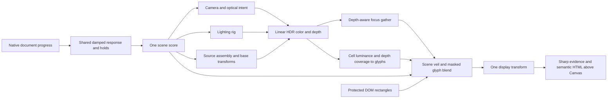

# Round 02 — scene-driven layers

Role: 3D Artist. Date: 8 October 2026, Europe/Berlin. Scope: the authorized local Bending-Active revision. This contract establishes the role before runtime integration; runtime captures and measured results must be recorded separately.

## Responsibility and influence graph

The existing 3D Artist becomes responsible for compositing. Its material/shader responsibility already covers how surfaces become pixels; a separate Compositor would duplicate ownership. Cinema authors focus/edit intent, Lighting Designer the radiance, Scene Designer the spatial setting, Animation Designer verified object transforms, Motion Designer one response clock, UIUX protected HTML, and the Director their dependency graph.

No backward edge exists: glyphs do not drive scene lighting or resample their own composited output. Pointer tilt changes spatial decoration only. It does not change paragraph order, evidence, optical subject or the selected source component.

## Concrete pipeline

1. Render the actual scene once to a capped-resolution `WebGLRenderTarget` with `HalfFloatType` color and `DepthTexture(UnsignedIntType)`. Keep scene shading linear; ordinary color textures are sRGB inputs, HDR environment/depth remain data. Use no MSAA initially for this target until measured need justifies its memory cost.
2. Read the actual depth from the same camera. For normal perspective depth `z`, positive axial distance is `near * far / (far - z * (far - near))`. This assumes normal depth; reject or adapt for reversed/logarithmic depth explicitly.
3. Gather nearby scene samples with radius `min(maxBlurPx, abs(depth - focusDistanceM) / max(depth, near) * apertureScale)`. Start with 17 samples including the centre; constrain silhouette bleeding using depth differences. `apertureScale` is an artistic coefficient, not an f-stop. Bypass the extra taps when radius/strength is zero.
4. Quantize screen coordinates into a coarse cell grid, sample **the original linear scene color and depth** at each cell centre, and derive luminance with Rec.709 weights. Compress HDR luminance for glyph selection, e.g. `Y / (1 + Y)`, then select an original glyph bitmap/atlas in a known dark-to-dense order. This is actual scene-derived ASCII, not random text. Generate an original tiny glyph atlas or procedural dot/stroke patterns; do not copy reference-site assets.
5. Form glyph opacity from authored chapter weight × real depth/coverage × luminance threshold × protected-region exclusion. A depth-only mask includes any floor/base in the scene. Name it **scene-derived** unless a separate subject ID mask excludes them. A depth threshold is not a claim that only the shell contributes. Keep the glyph mask derivative independent of the defocused image so a focus pull does not smear glyph topology.
6. Apply the edit veil only to the 3D image. Apply glyph blending below HTML using the exact declared operator. Run tone mapping and output color-space conversion once. Prefer linear compositing before this output transform; if a display-referred blend is deliberately chosen, document it and put it after tone mapping without another transform.
7. HTML body text and evidence photographs remain outside the postprocess chain and retain normal alpha. The Canvas stays non-interactive; the decorative surface is hidden from accessibility APIs. A quiet status label may call the representation “Scene-derived ASCII”, but must not imply curvature/stress analysis.

## Blend controls and masks

For backdrop channel `b`, glyph channel `s` and mask `a` in [0,1], select one operator and interpolate `mix(b, operation(b,s), a)`:

| Operator | Channel operation | Intended use |
|---|---|---|
| Normal | `s` | Restrained flat glyph color. |
| Screen | `1 - (1 - b) * (1 - s)` | Luminous glyph marks on a dark scene. Use scene colors limited to 0–1 for this operator, or state an HDR extension. |
| Multiply | `b * s` | Dark hatch/veil in the decorative group. |
| Add | `b + s` | Linear emitted accent; allow HDR and tone-map once. Do not call this screen. |

For HDR screen, the preferred alternative is `b + (1 - clamp(b, 0, 1)) * s`, clearly named `screen-limited`; HDR highlights remain unchanged above one rather than inverting the result. Use the selected name in diagnostics and tests. Initial recommendation is normal or screen-limited, with weight at most 0.28, and no glyphs during Make/Validation evidence emphasis.

Protected rectangles are collected from `[data-story-panel]`, `[data-story-media]`, controls and the persistent header. Convert client rectangles to UV coordinates with explicit Y inversion; pad by 12–20 CSS px and feather the exterior only. The entire interior mask is zero. Compute visible rectangles only, bound the uniform array length, and fall back to a coarse reading-side mask if capacity would overflow. Never silently drop a protected rectangle. Update on resize, scroll, font/image layout changes and focus. The HTML itself remains opaque enough to read even without shader masking.

Exact runtime controls are supplied by the shared score: `lens.focusDistanceM`, `lens.apertureScale`, `lens.maxBlurPx`, `edit.veil`, `layers.asciiWeight`, `layers.asciiCellPx`, `layers.asciiBlend`, `layers.asciiTint`, `layers.contourWeight`, `protectedRectsUv`. Cinematic camera orientation and the actual light/material result are upstream influences, not additional hidden glyph animation clocks.

## Cost, lifecycle and fallback

The default path adds one scene color/depth target and one full-screen pass. At 1440 × 900 with DPR 1.25, 1800 × 1125 pixels require approximately 24.3 MB for RGBA16F color plus 32-bit depth, excluding driver overhead and the existing scene. A second same-sized HDR target costs another 16.2 MB. A 17-tap gather plus glyph sampling is materially more expensive than direct rendering. The stock BokehPass adds another geometry pass and its 41 color samples; it is a useful reference, not the preferred default here.

Cap DPR at 1–1.25 for this path, initially without multi-sampling. Keep desktop and narrow-screen cost measurements separate. If half-float/depth rendering is unsupported or the context is lost, show the source poster and readable HTML. A reduced quality mode may keep a sharp scene and reduce/disable ASCII and DOF, while disclosing the actual rendering tier in diagnostics. Do not equate emulation with a measured physical phone.

Use one R3F render owner with positive render priority when the compositor renders explicitly; otherwise Fiber may also render the scene. Restore render-target/viewport state. Allocate once, resize on dimensions, and dispose depth/color targets, atlas, shader material and full-screen geometry. Do not create a second Canvas or a permanent animation loop. A demand frame is requested only while shared response, input, loading or resize changes the image.

## Evidence required before acceptance

- Fixed camera/light A/B: glyph occupancy/intensity changes with the actual rendered surface illumination; random/time-only glyphs do not pass.
- Fixed pose, two focus depths: near/far detail sharpness changes with actual depth. A uniform CSS filter does not pass.
- Focus off/on and ASCII off/on at identical score states; inspect silhouettes and tonal clipping, not just console errors.
- Protected text/photo masks in left/right/mobile layouts, long text, resized viewport and focus-visible controls; glyphs never texture the documentary evidence.
- Seven holds, transition boundaries, reversing and fast jumps. Reduced motion, fallback and hidden-tab behavior remain readable and still.
- No extra idle frames after response settles, stable GPU allocations on resize/remount, and explicit pass/triangle/texture counts. Source base is visibly included and not replaced by a scene-design floor.

## Source selection and integration

Primary sources checked online and against installed package source on 8 October 2026:

- [Three r186](https://github.com/mrdoob/three.js/releases/tag/r186), commit `9b4a2ac29c63ccb43fd51c5661f2f873ac2c39b8`; installed runtime remains exact `0.186.1`. Per-file SHA verification records differences rather than assuming the tag equals every patched package file.
- [DepthTexture](https://threejs.org/docs/pages/DepthTexture.html) and [BokehPass](https://threejs.org/docs/pages/BokehPass.html): real depth attachment and focus pass.
- [AsciiEffect](https://threejs.org/docs/pages/AsciiEffect.html) and pinned `examples/jsm/effects/AsciiEffect.js`: established luminance-to-character idea. Its CPU image readback/table generation is not used because this page needs bounded GPU work and protected DOM.
- [Pinned OutputPass](https://github.com/mrdoob/three.js/blob/9b4a2ac29c63ccb43fd51c5661f2f873ac2c39b8/examples/jsm/postprocessing/OutputPass.js): output conversion responsibility.
- [W3C Compositing and Blending Level 1](https://www.w3.org/TR/compositing-1/): explicit compositing/blending model. The operations here are limited to a decorative scene group; they are not a Photoshop project importer.

`layer-compositing` is original scoped skill text grounded in these sources. Existing root-pinned Three is sufficient; a new postprocessing wrapper or privileged MCP would add no needed capability. Existing isolated artist browser tools plus Node/Playwright verification are the appropriate tooling. No global tool registration, dependency upgrade or source asset upload is part of this choice. See `source-verification.json` for exact installed hashes and `verify-sources.mjs` for the repeatable read-only package check.
